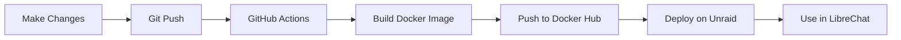

# Graphiti Custom Build Documentation

This directory contains documentation for building and deploying a custom Graphiti MCP server with your local changes.

## Quick Navigation

### 🐳 Docker Build Setup
**[GitHub-DockerHub-Setup.md](./GitHub-DockerHub-Setup.md)**
- Complete guide for automated Docker builds via GitHub Actions
- Builds with YOUR local graphiti-core changes (not PyPI)
- Pushes to Docker Hub (`lvarming/graphiti-mcp`)
- **Start here** if you want to build custom Docker images

### 🖥️ LibreChat Integration
**[Librechat.setup.md](./Librechat.setup.md)**
- Complete setup guide for Graphiti MCP + LibreChat + Neo4j on Unraid
- Uses your custom Docker image from Docker Hub
- Step-by-step deployment instructions

### 🔌 OpenAI API Compatibility
**[OpenAI-Compatible-Endpoints.md](./OpenAI-Compatible-Endpoints.md)**
- Analysis of OpenAI-compatible endpoint support
- Explains `/v1/responses` vs `/v1/chat/completions` issue
- Recommendations for supporting OpenRouter, Together.ai, Ollama, etc.

---

## Quick Start for Custom Builds

### 1. Setup GitHub → Docker Hub Pipeline

Follow **[GitHub-DockerHub-Setup.md](./GitHub-DockerHub-Setup.md)** to:
1. Create Docker Hub access token
2. Add token to GitHub repository secrets
3. Push changes to trigger automatic build

### 2. Deploy on Unraid

Follow **[Librechat.setup.md](./Librechat.setup.md)** to:
1. Configure Neo4j connection
2. Deploy Graphiti MCP container using `lvarming/graphiti-mcp:latest`
3. Integrate with LibreChat

---

## What's Different in This Setup?

### Standard Graphiti Deployment
```yaml
# Uses official image from PyPI
image: zepai/knowledge-graph-mcp:standalone
```

### Your Custom Deployment
```yaml
# Uses YOUR image with YOUR changes
image: lvarming/graphiti-mcp:latest
```

The custom image includes:
- ✅ Your local `graphiti-core` changes
- ✅ Your MCP server modifications
- ✅ Both Neo4j and FalkorDB drivers
- ✅ Built automatically on every push

---

## Files in This Repository

### Workflow Files
- `.github/workflows/build-custom-mcp.yml` - GitHub Actions workflow for automated builds

### Docker Files
- `mcp_server/docker/Dockerfile.custom` - Custom Dockerfile that uses local graphiti-core

### Documentation
- `DOCS/GitHub-DockerHub-Setup.md` - Docker build setup guide
- `DOCS/Librechat.setup.md` - LibreChat integration guide
- `DOCS/OpenAI-Compatible-Endpoints.md` - API compatibility analysis
- `DOCS/README.md` - This file

---

## Workflow Overview



1. **Make Changes** - Modify `graphiti_core/` or `mcp_server/`
2. **Git Push** - Push to `main` branch on GitHub
3. **GitHub Actions** - Automatically triggered
4. **Build Image** - Using `Dockerfile.custom` with local code
5. **Push to Docker Hub** - Tagged as `lvarming/graphiti-mcp:latest`
6. **Deploy on Unraid** - Pull latest image
7. **Use in LibreChat** - Configure MCP server URL

---

## Version Information

Your builds include comprehensive version tracking:

```bash
docker inspect lvarming/graphiti-mcp:latest | jq '.[0].Config.Labels'
```

Returns:
```json
{
  "org.opencontainers.image.title": "Graphiti MCP Server (Custom Build)",
  "org.opencontainers.image.version": "1.0.0",
  "graphiti.core.version": "0.23.0",
  "graphiti.core.source": "local",
  "org.opencontainers.image.revision": "abc1234",
  "org.opencontainers.image.created": "2025-11-08T12:00:00Z"
}
```

---

## Key Benefits

### 🚀 Automated
- No manual Docker builds
- No need to push images yourself
- Triggered automatically on code changes

### 🔄 Reproducible
- Every build is traced to a git commit
- Anyone can see exactly what was built
- Version labels include all metadata

### 🏗️ Multi-Platform
- Builds for AMD64 and ARM64
- Works on Intel, AMD, and Apple Silicon
- Single command works everywhere

### 🎯 Clean Workflow
- Professional CI/CD pipeline
- Follows industry best practices
- Easy to maintain and extend

---

## Support

### Issues with Docker Builds?
See [GitHub-DockerHub-Setup.md - Troubleshooting](./GitHub-DockerHub-Setup.md#troubleshooting)

### Issues with Deployment?
See [Librechat.setup.md - Troubleshooting](./Librechat.setup.md#troubleshooting)

### Issues with API Compatibility?
See [OpenAI-Compatible-Endpoints.md](./OpenAI-Compatible-Endpoints.md)

---

## Contributing

If you make improvements to these docs or workflows:

1. Update the relevant documentation file
2. Test the changes
3. Commit and push
4. (Optional) Share with the community via PR to upstream

---

## License

This documentation follows the same license as the Graphiti project.
