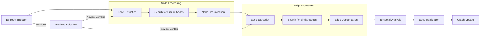
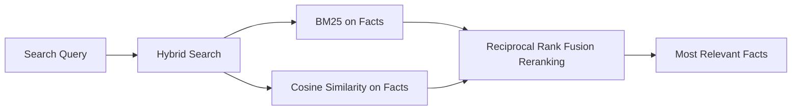

# graphiti: Temporal Knowledge Graphs for LLM-powered Agents

[](https://github.com/getzep/graphiti/actions/workflows/lint.yml)
[](https://github.com/getzep/graphiti/actions/workflows/unit_tests.yml)
[](https://github.com/getzep/graphiti/actions/workflows/typecheck.yml)
[](https://codespaces.new/getzep/graphiti)

graphiti builds dynamic, temporally-aware knowledge graphs that represent complex, evolving relationships between entities over time. graphiti ingests both unstructured and structured data and the resulting graph may be queried using a fusion of time, full-text, semantic, and graph algorithm approaches.

TODO: Add video here.

With graphiti, you can build LLM applications such as:

- assistants that learn from user interactions, using the graph to fuse knowledge about the user with dynamic, structured data from business applications such as CRMs, billing systems, and more.
- agents that autonomously carry out complex tasks with data sourced from multiple dynamic sources, utilizing the graph to reason with changes to environment state.

There are a broad set of Assistant and Agent applications across sales, customer service, health, finance, and more. graphiti is designed to support their long-term recall of state and their reasoning with state changes.

## Why build yet another graph library?

Unlike many other knowledge graph libraries, graphiti is purpose built for dynamic data and agentic use:

- New nodes and edges are evaluated against the current graph, with the new entities and current graph revised to reflect the new context.
- Facts, a natural language representation of the relationship between a source and destination node, are generated when graph-building and associated with edges.
- Dates or partial date information is extracted from input datas and edge `valid_at` / `invalid_at` fields updated to reflect this state.
- Graphiti offers semantic, BM25, and graph search, and various approaches to fuse results from multiple search modes.
- Search is designed to be fast < 100ms, and bounded by the latency of your embedding service's API.
- graphiti is careful to reuse an existing schema, avoiding an explosion in node and edge types.

## graphiti and Zep's Memory Layer for LLM Apps

TODO

## Installation

neo4j quick install: Desktop

Requirements: neo4j vector plugin apoc

`pip install graphiti-core`

or

`poetry add graphiti-core`

## Quick Start

```python
from graphiti import Graphiti

# Initialize Graphiti
graphiti = Graphiti("bolt://localhost:7687", "neo4j", "password")

# Process an episode
await graphiti.process_episode(
    name="Example Episode",
    episode_body="Alice met Bob at the coffee shop.",
    source_description="User input",
    reference_time=datetime.now()
)

# Retrieve recent episodes
recent_episodes = await graphiti.retrieve_episodes(last_n=5)

# Close the connection
graphiti.close()
```

## How graphiti works

### Adding Data as Episodes



### Graph Search



two quickest wins for search using the graph database is:

1. chunking. The graph structure means we have preformed chunks and the existing structure allows us to better chunk new episodes. (good chunking is pretty underrated in RAG imo)
2. Traditional RAG search, for things like facts, is good at finding the small chunked snippets of information, but its bad for providing summarized or more general context. The graph structure allows us to provide this context.

That is why in the complex search we are returning facts which are more specific to the wuery, and nodes which provide summaries about the entities involved. And in the future we can provide community summaries or context based on other forms of graph traversal

And the key there vs fact triplets is that it accomplishes 1 almost as well as a graph, but getting 2 out is not possible without basically creating a pseudo-graph

## Status and Roadmap

wip, but endavour to not break API.

graphiti is under active development. Areas we're actively working on:

- performance and scalability
- search improvements
- node CRUD

TODO: expand on the above. Include ROADMAP

Latency scales sublinearly with graph size, with a cap

## Contributing

## Support
