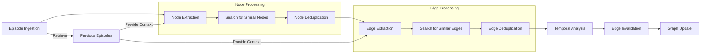
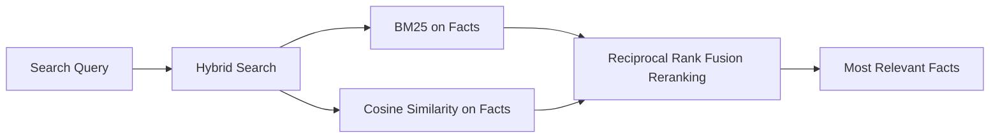

# graphiti: dynamic, temporally-aware knowledge graphs for LLM-powered agents

[](https://github.com/getzep/graphiti/actions/workflows/lint.yml)
[](https://github.com/getzep/graphiti/actions/workflows/unit_tests.yml)
[](https://github.com/getzep/graphiti/actions/workflows/typecheck.yml)
[](https://codespaces.new/getzep/graphiti)

graphiti builds dynamic, temporally-aware knowledge graphs that can represent complex, evolving relationships between entities over time. graphiti ingests both unstructured and structured data and the resulting graph may be queried using a fusion of time, full-text, semantic, and graph algorithm approaches.

TODO: Add video here.

With graphiti, you can build agentic applications that:

TODO

- memory (which is what Zep, the creators of graphiti, use it for)
- market / competitive research - reviews, product catalogs, and pricing data
- recommendations - user preferences and product changes
- hr - employee reviews, changes in org structure, and org planning
- Healthcare Predictive Analytics:
  An AI health assistant that combines electronic health records, wearable data, and lifestyle information to predict health risks and suggest personalized interventions, leveraging Graphiti's temporal analysis to track health trends over a patient's lifetime.
- Adaptive Learning Systems:
  An intelligent tutoring agent that integrates course materials, student performance data, and learning style assessments to create personalized learning paths, using Graphiti to model the evolution of a student's knowledge and skills over time.
- Dynamic Supply Chain Management:
  A supply chain optimization agent that fuses real-time inventory levels, shipping data, weather reports, and geopolitical news to anticipate disruptions and automatically adjust logistics strategies, utilizing Graphiti's temporal knowledge graph to model complex, evolving supply networks.
- Intelligent Market Analysis Agent:
  A financial strategy assistant that synthesizes company financial reports, economic indicators, news articles, and social media sentiment to provide real-time market insights and investment recommendations, employing Graphiti to track and correlate market trends across various time scales.
- Evolving Regulatory Compliance Assistants:
  A proactive compliance agent that integrates legislative updates, court rulings, internal policy documents, and industry best practices to ensure ongoing regulatory adherence, using Graphiti to maintain an up-to-date model of the regulatory landscape and its impact on business operations.

Unlike many other knowledge graph libraries, graphiti is:

- purpose built for data that changes over time. It intelligently maintains the graph, adding additional edges between nodes as "facts", represented by edges, are falsified. Episodes represent a single ingestion event, with nodes for each episode related to each other.
- designed for agentic applications. Searching a graph with graphiti returns natural language “facts”, not just triples. More below. Summaries are also generated …
- fast, with search results in <100ms (bounded by embedding model latency) and building a X node graph in less than Y (again, bounded by LLM inference speed).

## graphiti and Zep's Memory Layer for LLM Apps

TODO

## Installation

neo4j quick install: Desktop

Requirements: neo4j vector plugin apoc

`pip install graphiti-core`

or

`poetry add graphiti-core`

## Quick Start

```python
from graphiti import Graphiti

# Initialize Graphiti
graphiti = Graphiti("bolt://localhost:7687", "neo4j", "password")

# Process an episode
await graphiti.process_episode(
    name="Example Episode",
    episode_body="Alice met Bob at the coffee shop.",
    source_description="User input",
    reference_time=datetime.now()
)

# Retrieve recent episodes
recent_episodes = await graphiti.retrieve_episodes(last_n=5)

# Close the connection
graphiti.close()
```

## How graphiti works

### Adding Data as Episodes



### Graph Search



two quickest wins for search using the graph database is:

1. chunking. The graph structure means we have preformed chunks and the existing structure allows us to better chunk new episodes. (good chunking is pretty underrated in RAG imo)
2. Traditional RAG search, for things like facts, is good at finding the small chunked snippets of information, but its bad for providing summarized or more general context. The graph structure allows us to provide this context.

That is why in the complex search we are returning facts which are more specific to the wuery, and nodes which provide summaries about the entities involved. And in the future we can provide community summaries or context based on other forms of graph traversal

And the key there vs fact triplets is that it accomplishes 1 almost as well as a graph, but getting 2 out is not possible without basically creating a pseudo-graph

## Status and Roadmap

wip, but endavour to not break API.

graphiti is under active development. Areas we're actively working on:

- performance and scalability
- search improvements
- node CRUD

TODO: expand on the above. Include ROADMAP

Latency scales sublinearly with graph size, with a cap

## Contributing

## Support
