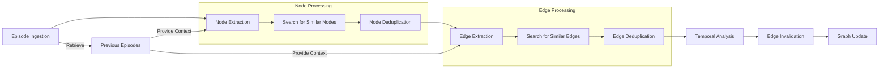
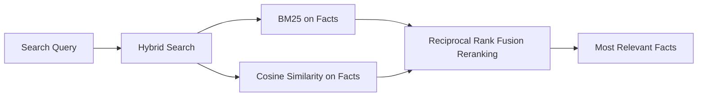

# graphiti: Temporal Knowledge Graphs for LLM-powered Agents

[](https://github.com/getzep/graphiti/actions/workflows/lint.yml)
[](https://github.com/getzep/graphiti/actions/workflows/unit_tests.yml)
[](https://github.com/getzep/graphiti/actions/workflows/typecheck.yml)
[](https://codespaces.new/getzep/graphiti)

graphiti builds dynamic, temporally-aware knowledge graphs that represent complex, evolving relationships between entities over time. graphiti ingests both unstructured and structured data and the resulting graph may be queried using a fusion of time, full-text, semantic, and graph algorithm approaches.

TODO: Add video here.

With graphiti, you can build LLM applications such as:

- Assistants that learn from user interactions, fusing personal knowledge with dynamic data from business systems like CRMs and billing platforms.
- Agents that autonomously execute complex tasks, reasoning with state changes from multiple dynamic sources.

graphiti supports a wide range of applications in sales, customer service, health, finance, and more, enabling long-term recall and state-based reasoning for both assistants and agents.

## Why graphiti?

graphiti is designed for dynamic data and agentic use:

- **Smart Graph Updates**: Automatically evaluates new entities against the current graph, revising both to reflect the latest context.
- **Rich Edge Semantics**: Generates human-readable, semantic, and full-text searchable representations for edges during graph construction, enabling search and enhancing interpretability.
- **Temporal Awareness**: Extracts and updates time-based edge metadata from input data, enabling reasoning over changing relationships.
- **Hybrid Search**: Offers semantic, BM25, and graph-based search with the ability to fuse results.
- **Fast**: Search results in < 100ms, with latency primarily determined by the 3rd-party embedding API call.
- **Schema Consistency**: Maintains a coherent graph structure by reusing existing schema, preventing unnecessary proliferation of node and edge types.

## graphiti and Zep Memory

graphiti powers the core of Zep's next-generation memory layer for LLM-powered Assistants and Agents.

We're excited to open-source graphiti, believing its potential reaches far beyond memory applications.

## Installation

Requirements: Python 3.10+ annd neo4j >=5.21

> [!NOTE]
> The simplest way to install Neo4j is via [Neo4j Desktop](https://neo4j.com/download/). It provides a user-friendly interface to manage Neo4j instances and databases.

`pip install graphiti-core`

or

`poetry add graphiti-core`

## Quick Start

```python
from graphiti import Graphiti

# Initialize Graphiti
graphiti = Graphiti("bolt://localhost:7687", "neo4j", "password")

# Process an episode
await graphiti.process_episode(
    name="Example Episode",
    episode_body="Alice met Bob at the coffee shop.",
    source_description="User input",
    reference_time=datetime.now()
)

# Retrieve recent episodes
recent_episodes = await graphiti.retrieve_episodes(last_n=5)

# Close the connection
graphiti.close()
```

## How graphiti works

### Adding Data as Episodes



### Graph Search



two quickest wins for search using the graph database is:

1. chunking. The graph structure means we have preformed chunks and the existing structure allows us to better chunk new episodes. (good chunking is pretty underrated in RAG imo)
2. Traditional RAG search, for things like facts, is good at finding the small chunked snippets of information, but its bad for providing summarized or more general context. The graph structure allows us to provide this context.

That is why in the complex search we are returning facts which are more specific to the wuery, and nodes which provide summaries about the entities involved. And in the future we can provide community summaries or context based on other forms of graph traversal

And the key there vs fact triplets is that it accomplishes 1 almost as well as a graph, but getting 2 out is not possible without basically creating a pseudo-graph

## Status and Roadmap

wip, but endavour to not break API.

graphiti is under active development. Areas we're actively working on:

- performance and scalability
- search improvements
- node CRUD

TODO: expand on the above. Include ROADMAP

Latency scales sublinearly with graph size, with a cap

## Contributing

## Support
