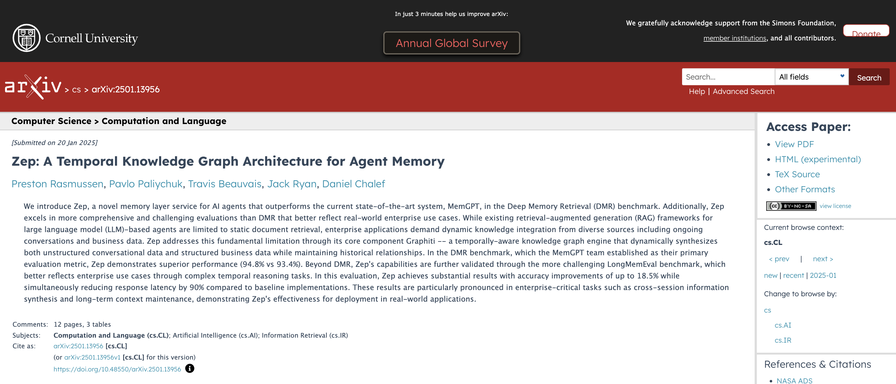

<p align="center">
  <a href="https://www.getzep.com/">
    
  </a>
</p>

<h1 align="center">
Graphiti
</h1>
<h2 align="center"> Build Real-Time Knowledge Graphs for AI Agents</h2>
<div align="center">

[](https://github.com/getzep/Graphiti/actions/workflows/lint.yml)
[](https://github.com/getzep/Graphiti/actions/workflows/unit_tests.yml)
[](https://github.com/getzep/Graphiti/actions/workflows/typecheck.yml)


[](https://discord.com/invite/W8Kw6bsgXQ)
[](https://arxiv.org/abs/2501.13956)
[](https://github.com/getzep/graphiti/releases)

</div>
<div align="center">

<a href="https://trendshift.io/repositories/12986" target="_blank"></a>

</div>

:star: _Help us reach more developers and grow the Graphiti community. Star this repo!_

<br />

> [!TIP]
> Check out the new [MCP server for Graphiti](mcp_server/README.md)! Give Claude, Cursor, and other MCP clients powerful Knowledge Graph-based memory.

Graphiti is a framework for building and querying temporally-aware knowledge graphs, specifically tailored for AI agents operating in dynamic environments. Unlike traditional retrieval-augmented generation (RAG) methods, Graphiti continuously integrates user interactions, structured and unstructured enterprise data, and external information into a coherent, queryable graph. The framework supports incremental data updates, efficient retrieval, and precise historical queries without requiring complete graph recomputation, making it suitable for developing interactive, context-aware AI applications.

Use Graphiti to:

- Integrate and maintain dynamic user interactions and business data.
- Facilitate state-based reasoning and task automation for agents.
- Query complex, evolving data with semantic, keyword, and graph-based search methods.

<br />

<p align="center">
       
</p>

<br />

A knowledge graph is a network of interconnected facts, such as _"Kendra loves Adidas shoes."_ Each fact is a "triplet" represented by two entities, or
nodes ("Kendra", "Adidas shoes"), and their relationship, or edge ("loves"). Knowledge Graphs have been explored
extensively for information retrieval. What makes Graphiti unique is its ability to autonomously build a knowledge graph
while handling changing relationships and maintaining historical context.

## Graphiti and Zep Memory

Graphiti powers the core of [Zep's memory layer](https://www.getzep.com) for AI Agents.

Using Graphiti, we've demonstrated Zep is
the [State of the Art in Agent Memory](https://blog.getzep.com/state-of-the-art-agent-memory/).

Read our paper: [Zep: A Temporal Knowledge Graph Architecture for Agent Memory](https://arxiv.org/abs/2501.13956).

We're excited to open-source Graphiti, believing its potential reaches far beyond AI memory applications.

<p align="center">
    <a href="https://arxiv.org/abs/2501.13956"></a>
</p>

## Why Graphiti?

Traditional RAG approaches often rely on batch processing and static data summarization, making them inefficient for frequently changing data. Graphiti addresses these challenges by providing:

- **Real-Time Incremental Updates:** Immediate integration of new data episodes without batch recomputation.
- **Bi-Temporal Data Model:** Explicit tracking of event occurrence and ingestion times, allowing accurate point-in-time queries.
- **Efficient Hybrid Retrieval:** Combines semantic embeddings, keyword (BM25), and graph traversal to achieve low-latency queries without reliance on LLM summarization.
- **Custom Entity Definitions:** Flexible ontology creation and support for developer-defined entities through straightforward Pydantic models.
- **Scalability:** Efficiently manages large datasets with parallel processing, suitable for enterprise environments.

<p align="center">
       
</p>

## Graphiti vs. GraphRAG

| Aspect                     | GraphRAG                              | Graphiti                                         |
| -------------------------- | ------------------------------------- | ------------------------------------------------ |
| **Primary Use**            | Static document summarization         | Dynamic data management                          |
| **Data Handling**          | Batch-oriented processing             | Continuous, incremental updates                  |
| **Knowledge Structure**    | Entity clusters & community summaries | Episodic data, semantic entities, communities    |
| **Retrieval Method**       | Sequential LLM summarization          | Hybrid semantic, keyword, and graph-based search |
| **Adaptability**           | Low                                   | High                                             |
| **Temporal Handling**      | Basic timestamp tracking              | Explicit bi-temporal tracking                    |
| **Contradiction Handling** | LLM-driven summarization judgments    | Temporal edge invalidation                       |
| **Query Latency**          | Seconds to tens of seconds            | Typically sub-second latency                     |
| **Custom Entity Types**    | No                                    | Yes, customizable                                |
| **Scalability**            | Moderate                              | High, optimized for large datasets               |

Graphiti is specifically designed to address the challenges of dynamic and frequently updated datasets, making it particularly suitable for applications requiring real-time interaction and precise historical queries.

## Installation

Requirements:

- Python 3.10 or higher
- Neo4j 5.26 / FalkorDB 1.1.2 or higher (serves as the embeddings storage backend)
- OpenAI API key (Graphiti defaults to OpenAI for LLM inference and embedding)

> [!IMPORTANT]
> Graphiti works best with LLM services that support Structured Output (such as OpenAI and Gemini).
> Using other services may result in incorrect output schemas and ingestion failures. This is particularly
> problematic when using smaller models.

Optional:

- Google Gemini, Anthropic, or Groq API key (for alternative LLM providers)

> [!TIP]
> The simplest way to install Neo4j is via [Neo4j Desktop](https://neo4j.com/download/). It provides a user-friendly
> interface to manage Neo4j instances and databases.
> Alternatively, you can use FalkorDB on-premises via Docker and instantly start with the quickstart example:

```bash
docker run -p 6379:6379 -p 3000:3000 -it --rm falkordb/falkordb:latest

```

```bash
pip install graphiti-core
```

or

```bash
uv add graphiti-core
```

### Installing with FalkorDB Support

If you plan to use FalkorDB as your graph database backend, install with the FalkorDB extra:

```bash
pip install graphiti-core[falkordb]

# or with uv
uv add graphiti-core[falkordb]
```

### You can also install optional LLM providers as extras:

```bash
# Install with Anthropic support
pip install graphiti-core[anthropic]

# Install with Groq support
pip install graphiti-core[groq]

# Install with Google Gemini support
pip install graphiti-core[google-genai]

# Install with multiple providers
pip install graphiti-core[anthropic,groq,google-genai]

# Install with FalkorDB and LLM providers
pip install graphiti-core[falkordb,anthropic,google-genai]
```

## Quick Start

> [!IMPORTANT]
> Graphiti defaults to using OpenAI for LLM inference and embedding. Ensure that an `OPENAI_API_KEY` is set in your environment.
> Support for Anthropic and Groq LLM inferences is available, too. Other LLM providers may be supported via OpenAI
> compatible APIs.

For a complete working example, see the [Quickstart Example](./examples/quickstart/README.md) in the examples directory. The quickstart demonstrates:

1. Connecting to a Neo4j or FalkorDB database
2. Initializing Graphiti indices and constraints
3. Adding episodes to the graph (both text and structured JSON)
4. Searching for relationships (edges) using hybrid search
5. Reranking search results using graph distance
6. Searching for nodes using predefined search recipes

The example is fully documented with clear explanations of each functionality and includes a comprehensive README with setup instructions and next steps.

## MCP Server

The `mcp_server` directory contains a Model Context Protocol (MCP) server implementation for Graphiti. This server allows AI assistants to interact with Graphiti's knowledge graph capabilities through the MCP protocol.

Key features of the MCP server include:

- Episode management (add, retrieve, delete)
- Entity management and relationship handling
- Semantic and hybrid search capabilities
- Group management for organizing related data
- Graph maintenance operations

The MCP server can be deployed using Docker with Neo4j, making it easy to integrate Graphiti into your AI assistant workflows.

For detailed setup instructions and usage examples, see the [MCP server README](./mcp_server/README.md).

## REST Service

The `server` directory contains an API service for interacting with the Graphiti API. It is built using FastAPI.

Please see the [server README](./server/README.md) for more information.

## Optional Environment Variables

In addition to the Neo4j and OpenAi-compatible credentials, Graphiti also has a few optional environment variables.
If you are using one of our supported models, such as Anthropic or Voyage models, the necessary environment variables
must be set.

### Database Configuration

Database names are configured directly in the driver constructors:

- **Neo4j**: Database name defaults to `neo4j` (hardcoded in Neo4jDriver)
- **FalkorDB**: Database name defaults to `default_db` (hardcoded in FalkorDriver)

As of v0.17.0, if you need to customize your database configuration, you can instantiate a database driver and pass it to the Graphiti constructor using the `graph_driver` parameter.

#### Neo4j with Custom Database Name

```python
from graphiti_core import Graphiti
from graphiti_core.driver.neo4j_driver import Neo4jDriver

# Create a Neo4j driver with custom database name
driver = Neo4jDriver(
    uri="bolt://localhost:7687",
    user="neo4j",
    password="password",
    database="my_custom_database"  # Custom database name
)

# Pass the driver to Graphiti
graphiti = Graphiti(graph_driver=driver)
```

#### FalkorDB with Custom Database Name

```python
from graphiti_core import Graphiti
from graphiti_core.driver.falkordb_driver import FalkorDriver

# Create a FalkorDB driver with custom database name
driver = FalkorDriver(
    host="localhost",
    port=6379,
    username="falkor_user",  # Optional
    password="falkor_password",  # Optional
    database="my_custom_graph"  # Custom database name
)

# Pass the driver to Graphiti
graphiti = Graphiti(graph_driver=driver)
```


### Performance Configuration

`USE_PARALLEL_RUNTIME` is an optional boolean variable that can be set to true if you wish
to enable Neo4j's parallel runtime feature for several of our search queries.
Note that this feature is not supported for Neo4j Community edition or for smaller AuraDB instances,
as such this feature is off by default.

## Using Graphiti with Azure OpenAI

Graphiti supports Azure OpenAI for both LLM inference and embeddings. Azure deployments often require different endpoints for LLM and embedding services, and separate deployments for default and small models.

```python
from openai import AsyncAzureOpenAI
from graphiti_core import Graphiti
from graphiti_core.llm_client import LLMConfig, OpenAIClient
from graphiti_core.embedder.openai import OpenAIEmbedder, OpenAIEmbedderConfig
from graphiti_core.cross_encoder.openai_reranker_client import OpenAIRerankerClient

# Azure OpenAI configuration - use separate endpoints for different services
api_key = "<your-api-key>"
api_version = "<your-api-version>"
llm_endpoint = "<your-llm-endpoint>"  # e.g., "https://your-llm-resource.openai.azure.com/"
embedding_endpoint = "<your-embedding-endpoint>"  # e.g., "https://your-embedding-resource.openai.azure.com/"

# Create separate Azure OpenAI clients for different services
llm_client_azure = AsyncAzureOpenAI(
    api_key=api_key,
    api_version=api_version,
    azure_endpoint=llm_endpoint
)

embedding_client_azure = AsyncAzureOpenAI(
    api_key=api_key,
    api_version=api_version,
    azure_endpoint=embedding_endpoint
)

# Create LLM Config with your Azure deployment names
azure_llm_config = LLMConfig(
    small_model="gpt-4.1-nano",
    model="gpt-4.1-mini",
)

# Initialize Graphiti with Azure OpenAI clients
graphiti = Graphiti(
    "bolt://localhost:7687",
    "neo4j",
    "password",
    llm_client=OpenAIClient(
        llm_config=azure_llm_config,
        client=llm_client_azure
    ),
    embedder=OpenAIEmbedder(
        config=OpenAIEmbedderConfig(
            embedding_model="text-embedding-3-small-deployment"  # Your Azure embedding deployment name
        ),
        client=embedding_client_azure
    ),
    cross_encoder=OpenAIRerankerClient(
        llm_config=LLMConfig(
            model=azure_llm_config.small_model  # Use small model for reranking
        ),
        client=llm_client_azure
    )
)

# Now you can use Graphiti with Azure OpenAI
```

Make sure to replace the placeholder values with your actual Azure OpenAI credentials and deployment names that match your Azure OpenAI service configuration.

## Using Graphiti with Google Gemini

Graphiti supports Google's Gemini models for LLM inference, embeddings, and cross-encoding/reranking. To use Gemini, you'll need to configure the LLM client, embedder, and the cross-encoder with your Google API key.

Install Graphiti:

```bash
uv add "graphiti-core[google-genai]"

# or

pip install "graphiti-core[google-genai]"
```

```python
from graphiti_core import Graphiti
from graphiti_core.llm_client.gemini_client import GeminiClient, LLMConfig
from graphiti_core.embedder.gemini import GeminiEmbedder, GeminiEmbedderConfig
from graphiti_core.cross_encoder.gemini_reranker_client import GeminiRerankerClient

# Google API key configuration
api_key = "<your-google-api-key>"

# Initialize Graphiti with Gemini clients
graphiti = Graphiti(
    "bolt://localhost:7687",
    "neo4j",
    "password",
    llm_client=GeminiClient(
        config=LLMConfig(
            api_key=api_key,
            model="gemini-2.0-flash"
        )
    ),
    embedder=GeminiEmbedder(
        config=GeminiEmbedderConfig(
            api_key=api_key,
            embedding_model="embedding-001"
        )
    ),
    cross_encoder=GeminiRerankerClient(
        config=LLMConfig(
            api_key=api_key,
            model="gemini-2.5-flash-lite-preview-06-17"
        )
    )
)

# Now you can use Graphiti with Google Gemini for all components
```

The Gemini reranker uses the `gemini-2.5-flash-lite-preview-06-17` model by default, which is optimized for cost-effective and low-latency classification tasks. It uses the same boolean classification approach as the OpenAI reranker, leveraging Gemini's log probabilities feature to rank passage relevance.

## Using Graphiti with Ollama (Local LLM)

Graphiti supports Ollama for running local LLMs and embedding models via Ollama's OpenAI-compatible API. This is ideal for privacy-focused applications or when you want to avoid API costs.

Install the models:
ollama pull deepseek-r1:7b # LLM
ollama pull nomic-embed-text # embeddings

```python
from graphiti_core import Graphiti
from graphiti_core.llm_client.config import LLMConfig
from graphiti_core.llm_client.openai_client import OpenAIClient
from graphiti_core.embedder.openai import OpenAIEmbedder, OpenAIEmbedderConfig
from graphiti_core.cross_encoder.openai_reranker_client import OpenAIRerankerClient

# Configure Ollama LLM client
llm_config = LLMConfig(
    api_key="abc",  # Ollama doesn't require a real API key
    model="deepseek-r1:7b",
    small_model="deepseek-r1:7b",
    base_url="http://localhost:11434/v1", # Ollama provides this port
)

llm_client = OpenAIClient(config=llm_config)

# Initialize Graphiti with Ollama clients
graphiti = Graphiti(
    "bolt://localhost:7687",
    "neo4j",
    "password",
    llm_client=llm_client,
    embedder=OpenAIEmbedder(
        config=OpenAIEmbedderConfig(
            api_key="abc",
            embedding_model="nomic-embed-text",
            embedding_dim=768,
            base_url="http://localhost:11434/v1",
        )
    ),
    cross_encoder=OpenAIRerankerClient(client=llm_client, config=llm_config),
)

# Now you can use Graphiti with local Ollama models
```

Ensure Ollama is running (`ollama serve`) and that you have pulled the models you want to use.

## Documentation

- [Guides and API documentation](https://help.getzep.com/graphiti).
- [Quick Start](https://help.getzep.com/graphiti/graphiti/quick-start)
- [Building an agent with LangChain's LangGraph and Graphiti](https://help.getzep.com/graphiti/graphiti/lang-graph-agent)

## Telemetry

Graphiti collects anonymous usage statistics to help us understand how the framework is being used and improve it for everyone. We believe transparency is important, so here's exactly what we collect and why.

### What We Collect

When you initialize a Graphiti instance, we collect:

- **Anonymous identifier**: A randomly generated UUID stored locally in `~/.cache/graphiti/telemetry_anon_id`
- **System information**: Operating system, Python version, and system architecture
- **Graphiti version**: The version you're using
- **Configuration choices**:
  - LLM provider type (OpenAI, Azure, Anthropic, etc.)
  - Database backend (Neo4j, FalkorDB)
  - Embedder provider (OpenAI, Azure, Voyage, etc.)

### What We Don't Collect

We are committed to protecting your privacy. We **never** collect:

- Personal information or identifiers
- API keys or credentials
- Your actual data, queries, or graph content
- IP addresses or hostnames
- File paths or system-specific information
- Any content from your episodes, nodes, or edges

### Why We Collect This Data

This information helps us:

- Understand which configurations are most popular to prioritize support and testing
- Identify which LLM and database providers to focus development efforts on
- Track adoption patterns to guide our roadmap
- Ensure compatibility across different Python versions and operating systems

By sharing this anonymous information, you help us make Graphiti better for everyone in the community.

### View the Telemetry Code

The Telemetry code [may be found here](graphiti_core/telemetry/telemetry.py).

### How to Disable Telemetry

Telemetry is **opt-out** and can be disabled at any time. To disable telemetry collection:

**Option 1: Environment Variable**

```bash
export GRAPHITI_TELEMETRY_ENABLED=false
```

**Option 2: Set in your shell profile**

```bash
# For bash users (~/.bashrc or ~/.bash_profile)
echo 'export GRAPHITI_TELEMETRY_ENABLED=false' >> ~/.bashrc

# For zsh users (~/.zshrc)
echo 'export GRAPHITI_TELEMETRY_ENABLED=false' >> ~/.zshrc
```

**Option 3: Set for a specific Python session**

```python
import os
os.environ['GRAPHITI_TELEMETRY_ENABLED'] = 'false'

# Then initialize Graphiti as usual
from graphiti_core import Graphiti
graphiti = Graphiti(...)
```

Telemetry is automatically disabled during test runs (when `pytest` is detected).

### Technical Details

- Telemetry uses PostHog for anonymous analytics collection
- All telemetry operations are designed to fail silently - they will never interrupt your application or affect Graphiti functionality
- The anonymous ID is stored locally and is not tied to any personal information

## Status and Roadmap

Graphiti is under active development. We aim to maintain API stability while working on:

- [x] Supporting custom graph schemas:
  - Allow developers to provide their own defined node and edge classes when ingesting episodes
  - Enable more flexible knowledge representation tailored to specific use cases
- [x] Enhancing retrieval capabilities with more robust and configurable options
- [x] Graphiti MCP Server
- [ ] Expanding test coverage to ensure reliability and catch edge cases

## Contributing

We encourage and appreciate all forms of contributions, whether it's code, documentation, addressing GitHub Issues, or
answering questions in the Graphiti Discord channel. For detailed guidelines on code contributions, please refer
to [CONTRIBUTING](CONTRIBUTING.md).

## Support

Join the [Zep Discord server](https://discord.com/invite/W8Kw6bsgXQ) and make your way to the **#Graphiti** channel!
