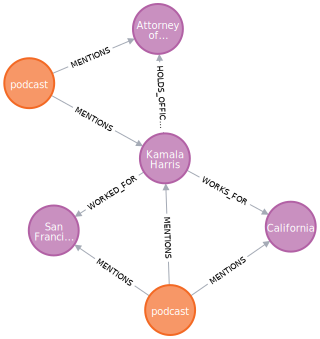

# graphiti: Temporal Knowledge Graphs for Agentic Applications

[](https://github.com/getzep/graphiti/actions/workflows/lint.yml)
[](https://github.com/getzep/graphiti/actions/workflows/unit_tests.yml)
[](https://github.com/getzep/graphiti/actions/workflows/typecheck.yml)
[](https://codespaces.new/getzep/graphiti)

graphiti builds dynamic, temporally-aware knowledge graphs that represent complex, evolving relationships between entities over time. graphiti ingests both unstructured and structured data and the resulting graph may be queried using a fusion of time, full-text, semantic, and graph algorithm approaches.

TODO: Add video here.

With graphiti, you can build LLM applications such as:

- Assistants that learn from user interactions, fusing personal knowledge with dynamic data from business systems like CRMs and billing platforms.
- Agents that autonomously execute complex tasks, reasoning with state changes from multiple dynamic sources.

graphiti supports a wide range of applications in sales, customer service, health, finance, and more, enabling long-term recall and state-based reasoning for both assistants and agents.

## Why graphiti?

graphiti is designed for dynamic data and agentic use:

- **Smart Graph Updates**: Automatically evaluates new entities against the current graph, revising both to reflect the latest context.
- **Rich Edge Semantics**: Generates human-readable, semantic, and full-text searchable representations for edges during graph construction, enabling search and enhancing interpretability.
- **Temporal Awareness**: Extracts and updates time-based edge metadata from input data, enabling reasoning over changing relationships.
- **Hybrid Search**: Offers semantic, BM25, and graph-based search with the ability to fuse results.
- **Fast**: Search results in < 100ms, with latency primarily determined by the 3rd-party embedding API call.
- **Schema Consistency**: Maintains a coherent graph structure by reusing existing schema, preventing unnecessary proliferation of node and edge types.

## graphiti and Zep Memory

graphiti powers the core of Zep's next-generation memory layer for LLM-powered Assistants and Agents.

We're excited to open-source graphiti, believing its potential reaches far beyond memory applications.

## Installation

Requirements:

- Python 3.10 or higher
- Neo4j 5.21 or higher
- OpenAI API key (for LLM inference and embedding)

Optional:

- Anthropic or Groq API key (for alternative LLM providers)

> [!TIP]
> The simplest way to install Neo4j is via [Neo4j Desktop](https://neo4j.com/download/). It provides a user-friendly interface to manage Neo4j instances and databases.

`pip install graphiti-core`

or

`poetry add graphiti-core`

## Quick Start

> [!IMPORTANT]
> Zep uses OpenAI for LLM inference and embedding. Ensure that an `OPENAI_API_KEY` is set in your environment. Support for Anthropic and Groq LLM inferences is available, too.

```python
from graphiti_core import Graphiti
from graphiti_core.nodes import EpisodeType
from datetime import datetime

# Initialize Graphiti
graphiti = Graphiti("bolt://localhost:7687", "neo4j", "password")

# Add episodes
episodes = [
    "Kamala Harris is the Attorney General of California. She was previously "
    "the district attorney for San Francisco.",
    "As AG, Harris was in office from January 3, 2011 – January 3, 2017",
]
for i, episode in enumerate(episodes):
    await graphiti.add_episode(
        name=f"Freakonomics Radio {i}",
        episode_body=episode,
        source=EpisodeType.text,
        source_description="podcast",
        reference_time=datetime.now()
    )

# Search the graph
# Execute a hybrid search combining semantic similarity and BM25 retrieval
# Results are combined and reranked using Reciprocal Rank Fusion
results = await graphiti.search('Who was the California Attorney General?')
[
    EntityEdge(
    │   uuid='3133258f738e487383f07b04e15d4ac0',
    │   source_node_uuid='2a85789b318d4e418050506879906e62',
    │   target_node_uuid='baf7781f445945989d6e4f927f881556',
    │   created_at=datetime.datetime(2024, 8, 26, 13, 13, 24, 861097),
    │   name='HELD_POSITION',
        # the fact reflects the updated state that Harris is
        # no longer the AG of California
    │   fact='Kamala Harris was the Attorney General of California',
    │   fact_embedding=[
    │   │   -0.009955154731869698,
    │       ...
    │   │   0.00784289836883545
    │   ],
    │   episodes=['b43e98ad0a904088a76c67985caecc22'],
    │   expired_at=datetime.datetime(2024, 8, 26, 20, 18, 1, 53812),
        # These dates represent the date this edge was true.
    │   valid_at=datetime.datetime(2011, 1, 3, 0, 0, tzinfo=<UTC>),
    │   invalid_at=datetime.datetime(2017, 1, 3, 0, 0, tzinfo=<UTC>)
    )
]

# Rerank search results based on graph distance
# Provide a node UUID to prioritize results closer to that node in the graph.
# Results are weighted by their proximity, with distant edges receiving lower scores.
await client.search('Who was the California Attorney General?', center_node_uuid)

# Close the connection
graphiti.close()
```

## Documentation

### Adding Episodes

Episodes represent a single data ingestion event. An `episode` is itself a node, and any nodes identified while ingesting the
episode are related to the episode via `MENTIONS` edges.

Episodes enable querying for information at a point in time and understanding the provenance of nodes and their edge relationships.

Supported episode types:

- `text`: Unstructured text data
- `message`: Conversational messages of the format `speaker: message...`
- `json`: Structured data, processed distinctly from the other types

The graph below was generated using the code in the [Quick Start](#quick-start). Each "podcast" is an individual episode.



#### Adding a `text` or `message` Episode

Using the `EpisodeType.text` type:

```python
await graphiti.add_episode(
    name="tech_innovation_article",
    episode_body=(
        "MIT researchers have unveiled 'ClimateNet', an AI system capable of predicting "
        "climate patterns with unprecedented accuracy. Early tests show it can forecast "
        "major weather events up to three weeks in advance, potentially revolutionizing "
        "disaster preparedness and agricultural planning."
    ),
    source=EpisodeType.text,
    # A description of the source (e.g., "podcast", "news article")
    source_description="Technology magazine article",
    # The timestamp for when this episode occurred or was created
    reference_time=datetime(2023, 11, 15, 9, 30),
    # Additional metadata about the episode (optional)
    metadata={
        "author": "Zara Patel",
        "publication": "Tech Horizons Monthly",
        "word_count": 39
    }
)
```

Using the `EpisodeType.message` type supports passing in multi-turn conversations in the `episode_body`.

The text should be structured in `{role/name}: {message}` pairs.

```python
await graphiti.add_episode(
    name="Customer_Support_Interaction_1",
    episode_body=(
        "Customer: Hi, I'm having trouble with my Allbirds shoes. "
        "The sole is coming off after only 2 months of use.\n"
        "Support: I'm sorry to hear that. Can you please provide your order number?"
    ),
    source=EpisodeType.message,
    source_description="Customer support chat",
    reference_time=datetime(2024, 3, 15, 14, 45),
    metadata={
        "channel": "Live Chat",
        "agent_id": "SP001",
        "customer_id": "C12345"
    }
)
```

#### Adding an Epsiode using structured data in JSON format

JSON documents can be arbitrarily nested. However, it's advisable to keep documents compact, as they must fit within your LLM's context window.

> [!TIP]
> For large data imports, consider using the `add_episode_bulk` API to efficiently add multiple episodes at once.

```python
product_data = {
    "id": "PROD001",
    "name": "Men's SuperLight Wool Runners",
    "color": "Dark Grey",
    "sole_color": "Medium Grey",
    "material": "Wool",
    "technology": "SuperLight Foam",
    "price": 125.00,
    "in_stock": True,
    "last_updated": "2024-03-15T10:30:00Z"
}

# Add the episode to the graph
await graphiti.add_episode(
    name="Product Update - PROD001",
    episode_body=product_data,  # Pass the Python dictionary directly
    source=EpisodeType.json,
    source_description="Allbirds product catalog update",
    reference_time=datetime.now(),
    metadata={
        "update_type": "product_info",
        "catalog_version": "v2.3"
    }
)
```

#### Loading Episodes in Bulk

Graphiti offers `add_episode_bulk` for efficient batch ingestion of episodes, significantly outperforming `add_episode` for large datasets. This method is highly recommended for bulk loading.

> [!WARNING]
> Use `add_episode_bulk` only for populating empty graphs or when edge invalidation is not required. The bulk ingestion pipeline does not perform edge invalidation operations.

```python
product_data = [
    {
        "id": "PROD001",
        "name": "Men's SuperLight Wool Runners",
        "color": "Dark Grey",
        "sole_color": "Medium Grey",
        "material": "Wool",
        "technology": "SuperLight Foam",
        "price": 125.00,
        "in_stock": true,
        "last_updated": "2024-03-15T10:30:00Z"
    },
    ...
    {
        "id": "PROD0100",
        "name": "Kids Wool Runner-up Mizzles",
        "color": "Natural Grey",
        "sole_color": "Orange",
        "material": "Wool",
        "technology": "Water-repellent",
        "price": 80.00,
        "in_stock": true,
        "last_updated": "2024-03-17T14:45:00Z"
    }
]

# Prepare the episodes for bulk loading
bulk_episodes = [
    RawEpisode(
        name=f"Product Update - {product['id']}",
        content=json.dumps(product),
        source=EpisodeType.json,
        source_description="Allbirds product catalog update",
        reference_time=datetime.now()
    )
    for product in product_data
]

await graphiti.add_episode_bulk(bulk_episodes)
```

### Searching graphiti's graph

The examples below demonstrate two search approaches in the graphiti library:

1. **Hybrid Search:**

   ```python
   await graphiti.search(query)
   ```

   Combines semantic similarity and BM25 retrieval, reranked using Reciprocal Rank Fusion.

   Example: Does a broad retrieval of facts related to Allbirds Wool Runners and Jane's purchase.

2. **Node Distance Reranking:**

   ```python
   await client.search(query, focal_node_uuid)
   ```

   Extends Hybrid Search above by prioritizing results based on proximity to a specified node in the graph.

   Example: Focuses on Jane-specific information, highlighting her wool allergy.

Node Distance Reranking is particularly useful for entity-specific queries, providing more contextually relevant results. It weights facts by their closeness to the focal node, emphasizing information directly related to the entity of interest.

This dual approach allows for both broad exploration and targeted, entity-specific information retrieval from the knowledge graph.

```python
query = "Can Jane wear Allbirds Wool Runners?"
jane_node_uuid = "123e4567-e89b-12d3-a456-426614174000"

def print_facts(edges):
    print("\n".join([edge.fact for edge in edges]))

# Hybrid Search
results = await graphiti.search(query)
print_facts(results)

> The Allbirds Wool Runners are sold by Allbirds.
> Men's SuperLight Wool Runners - Dark Grey (Medium Grey Sole) has a runner silhouette.
> Jane purchased SuperLight Wool Runners.

# Hybrid Search with Node Distance Reranking
await client.search(query, jane_node_uuid)
print_facts(results)

> Jane purchased SuperLight Wool Runners.
> Jane is allergic to wool.
> The Allbirds Wool Runners are sold by Allbirds.
```

## Status and Roadmap

wip, but endavour to not break API.

graphiti is under active development. Areas we're actively working on:

- performance and scalability
- search improvements
- node CRUD

TODO: expand on the above. Include ROADMAP

Latency scales sublinearly with graph size, with a cap

## Contributing

We encourage and appreciate all forms of contributions, whether it's code, documentation, addressing GitHub Issues, or answering questions in the graphiti Discord channel. For detailed guidelines on code contributions, please refer to [CONTRIBUTING](CONTRIBUTING.md).

## Support

Join the [Zep Discord server](https://discord.com/invite/W8Kw6bsgXQ) and make your way to the **#graphiti** channel!
