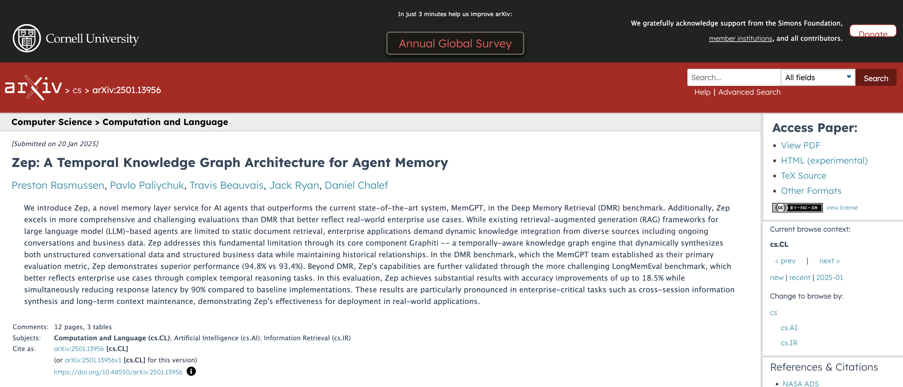

<p align="center">
  <a href="https://www.getzep.com/">
    
  </a>
</p>

<h1 align="center">
Graphiti
</h1>
<h2 align="center">Build Temporal Context Graphs for AI Agents</h2>

<div align="center">

[](https://github.com/getzep/Graphiti/actions/workflows/lint.yml)
[](https://github.com/getzep/Graphiti/actions/workflows/unit_tests.yml)
[](https://github.com/getzep/Graphiti/actions/workflows/typecheck.yml)

[](https://github.com/getzep/graphiti/stargazers)
[](https://discord.com/invite/W8Kw6bsgXQ)
[](https://arxiv.org/abs/2501.13956)
[](https://github.com/getzep/graphiti/releases)

</div>
<div align="center">

<a href="https://trendshift.io/repositories/12986" target="_blank"></a>

</div>

> [!NOTE]
> **We're Hiring!** Build context graphs that power reliable, personalized, fast production AI agents.
> Come build with us — we're hiring Engineers and Developer Relations folks. [View open roles](https://www.getzep.com/careers/).

⭐ *Help us reach more developers and grow the Graphiti community. Star this repo!*

&nbsp;

> [!TIP]
> Check out the new [MCP server for Graphiti](mcp_server/README.md)! Give Claude, Cursor, and other MCP clients powerful
> context graph-based memory with temporal awareness.

Graphiti is a framework for building and querying temporal context graphs for AI agents. Unlike static knowledge graphs,
Graphiti's context graphs track how facts change over time, maintain provenance to source data, and support both
prescribed and learned ontology — making them purpose-built for agents operating on evolving, real-world data.

Unlike traditional retrieval-augmented generation (RAG) methods, Graphiti continuously integrates user interactions,
structured and unstructured enterprise data, and external information into a coherent, queryable graph. The framework
supports incremental data updates, efficient retrieval, and precise historical queries without requiring complete graph
recomputation, making it suitable for developing interactive, context-aware AI applications.

Use Graphiti to:

- Build context graphs that evolve with every interaction — tracking what's true now and what was true before.
- Give agents rich, structured context instead of flat document chunks or raw chat history.
- Query across time, meaning, and relationships with hybrid retrieval (semantic + keyword + graph traversal).

&nbsp;

<p align="center">
    
</p>

&nbsp;

## What is a Context Graph?

A **context graph** is a temporal graph of entities, relationships, and facts — like *"Kendra loves Adidas shoes (as of
March 2026)."* Unlike traditional knowledge graphs, each fact in a context graph has a validity window: when it became
true, and when (if ever) it was superseded. Entities evolve over time with updated summaries. Everything traces back to
**episodes** — the raw data that produced it.

What makes Graphiti unique is its ability to autonomously build context graphs from unstructured and structured data,
handling changing relationships while preserving full temporal history.

A context graph contains:

| Component | What it stores |
|-----------|---------------|
| **Entities** (nodes) | People, products, policies, concepts — with summaries that evolve over time |
| **Facts / Relationships** (edges) | Triplets (Entity → Relationship → Entity) with temporal validity windows |
| **Episodes** (provenance) | Raw data as ingested — the ground truth stream. Every derived fact traces back here |
| **Custom Types** (ontology) | Developer-defined entity and edge types via Pydantic models |

## Graphiti and Zep

Graphiti is the open-source temporal context graph engine at the core of
[Zep's](https://www.getzep.com) context infrastructure for AI agents. Zep manages context graphs at scale, providing
governed, low-latency context retrieval and assembly for production agent deployments.

Using Graphiti, we've demonstrated Zep is
the [State of the Art in Agent Memory](https://blog.getzep.com/state-of-the-art-agent-memory/).

Read our paper: [Zep: A Temporal Knowledge Graph Architecture for Agent Memory](https://arxiv.org/abs/2501.13956).

We're excited to open-source Graphiti, believing its potential as a context graph engine reaches far beyond memory
applications.

<p align="center">
    <a href="https://arxiv.org/abs/2501.13956"></a>
</p>

## Zep vs Graphiti

| Aspect | Zep | Graphiti |
|--------|-----|---------|
| **What they are** | Managed context graph infrastructure for AI agents | Open-source temporal context graph engine |
| **Context graphs** | Manages vast numbers of per-user/entity context graphs with governance | Build and query individual context graphs |
| **User & conversation management** | Built-in users, threads, and message storage | Build your own |
| **Retrieval & performance** | Pre-configured, production-ready retrieval with sub-200ms performance at scale | Custom implementation required; performance depends on your setup |
| **Developer tools** | Dashboard with graph visualization, debug logs, API logs; SDKs for Python, TypeScript, and Go | Build your own tools |
| **Enterprise features** | SLAs, support, security guarantees | Self-managed |
| **Deployment** | Fully managed or in your cloud | Self-hosted only |

### When to choose which

**Choose Zep** if you want a turnkey, enterprise-grade platform with security, performance, and support baked in.

**Choose Graphiti** if you want a flexible OSS core and you're comfortable building/operating the surrounding system.

## Why Graphiti?

Traditional RAG approaches often rely on batch processing and static data summarization, making them inefficient for
frequently changing data. Graphiti addresses these challenges by providing:

- **Temporal Fact Management:** Facts have validity windows. When information changes, old facts are
  invalidated — not deleted. Query what's true now, or what was true at any point in time.
- **Episodes & Provenance:** Every entity and relationship traces back to the episodes (raw data) that produced it.
  Full lineage from derived fact to source.
- **Prescribed & Learned Ontology:** Define entity and edge types upfront via Pydantic models (prescribed), or let
  structure emerge from your data (learned). Start simple, evolve as patterns appear.
- **Incremental Graph Construction:** New data integrates immediately without batch recomputation. The graph evolves
  in real-time as episodes are ingested.
- **Hybrid Retrieval:** Combines semantic embeddings, keyword (BM25), and graph traversal for low-latency,
  high-precision queries without reliance on LLM summarization.
- **Scalability:** Efficiently manages large datasets with parallel processing, pluggable graph backends, suitable
  for enterprise workloads.

<p align="center">
    
</p>

## Graphiti vs. GraphRAG

| Aspect | GraphRAG | Graphiti |
|--------|----------|---------|
| **Primary Use** | Static document summarization | Dynamic, evolving context for agents |
| **Data Handling** | Batch-oriented processing | Continuous, incremental updates |
| **Knowledge Structure** | Entity clusters & community summaries | Temporal context graph — entities, facts with validity windows, episodes, communities |
| **Retrieval Method** | Sequential LLM summarization | Hybrid semantic, keyword, and graph-based search |
| **Adaptability** | Low | High |
| **Temporal Handling** | Basic timestamp tracking | Explicit bi-temporal tracking with automatic fact invalidation |
| **Contradiction Handling** | LLM-driven summarization judgments | Automatic fact invalidation with temporal history preserved |
| **Query Latency** | Seconds to tens of seconds | Typically sub-second latency |
| **Custom Entity Types** | No | Yes, customizable via Pydantic models |
| **Scalability** | Moderate | High, optimized for large datasets |

Graphiti is specifically designed to address the challenges of dynamic and frequently updated datasets, making it
particularly suitable for applications requiring real-time interaction and precise historical queries.

## Installation

Requirements:

- Python 3.10 or higher
- Neo4j 5.26 / FalkorDB 1.1.2 / Kuzu 0.11.2 / Amazon Neptune Database Cluster or Neptune Analytics Graph + Amazon
  OpenSearch Serverless collection (serves as the full text search backend)
- OpenAI API key (Graphiti defaults to OpenAI for LLM inference and embedding)

> [!IMPORTANT]
> Graphiti works best with LLM services that support Structured Output (such as OpenAI and Gemini).
> Using other services may result in incorrect output schemas and ingestion failures. This is particularly
> problematic when using smaller models.

Optional:

- Google Gemini, Anthropic, or Groq API key (for alternative LLM providers)

> [!TIP]
> The simplest way to install Neo4j is via [Neo4j Desktop](https://neo4j.com/download/). It provides a user-friendly
> interface to manage Neo4j instances and databases.
> Alternatively, you can use FalkorDB on-premises via Docker and instantly start with the quickstart example:
> ```
> docker run -p 6379:6379 -p 3000:3000 -it --rm falkordb/falkordb:latest
> ```

```bash
pip install graphiti-core
```

or

```bash
uv add graphiti-core
```

### Installing with FalkorDB Support

If you plan to use FalkorDB as your graph database backend, install with the FalkorDB extra:

```bash
pip install graphiti-core[falkordb]

# or with uv
uv add graphiti-core[falkordb]
```

### Installing with Kuzu Support

If you plan to use Kuzu as your graph database backend, install with the Kuzu extra:

```bash
pip install graphiti-core[kuzu]

# or with uv
uv add graphiti-core[kuzu]
```

### Installing with Amazon Neptune Support

If you plan to use Amazon Neptune as your graph database backend, install with the Amazon Neptune extra:

```bash
pip install graphiti-core[neptune]

# or with uv
uv add graphiti-core[neptune]
```

### You can also install optional LLM providers as extras:

```bash
# Install with Anthropic support
pip install graphiti-core[anthropic]

# Install with Groq support
pip install graphiti-core[groq]

# Install with Google Gemini support
pip install graphiti-core[google-genai]

# Install with multiple providers
pip install graphiti-core[anthropic,groq,google-genai]

# Install with FalkorDB and LLM providers
pip install graphiti-core[falkordb,anthropic,google-genai]

# Install with Amazon Neptune
pip install graphiti-core[neptune]
```

## Default to Low Concurrency; LLM Provider 429 Rate Limit Errors

Graphiti's ingestion pipelines are designed for high concurrency. By default, concurrency is set low to avoid LLM
Provider 429 Rate Limit Errors. If you find Graphiti slow, please increase concurrency as described below.

Concurrency controlled by the `SEMAPHORE_LIMIT` environment variable. By default, `SEMAPHORE_LIMIT` is set to `10`
concurrent operations to help prevent `429` rate limit errors from your LLM provider. If you encounter such errors, try
lowering this value.

If your LLM provider allows higher throughput, you can increase `SEMAPHORE_LIMIT` to boost episode ingestion
performance.

## Quick Start

> [!IMPORTANT]
> Graphiti defaults to using OpenAI for LLM inference and embedding. Ensure that an `OPENAI_API_KEY` is set in your
> environment.
> Support for Anthropic and Groq LLM inferences is available, too. Other LLM providers may be supported via OpenAI
> compatible APIs.

For a complete working example, see the [Quickstart Example](examples/quickstart/README.md) in the examples directory.
The quickstart demonstrates:

1. Connecting to a Neo4j, Amazon Neptune, FalkorDB, or Kuzu database
2. Initializing Graphiti indices and constraints
3. Adding episodes to the graph (both text and structured JSON)
4. Searching for relationships (edges) using hybrid search
5. Reranking search results using graph distance
6. Searching for nodes using predefined search recipes

The example is fully documented with clear explanations of each functionality and includes a comprehensive README with
setup instructions and next steps.

### Running with Docker Compose

You can use Docker Compose to quickly start the required services:

- **Neo4j Docker:**

  ```bash
  docker compose up
  ```

  This will start the Neo4j Docker service and related components.

- **FalkorDB Docker:**

  ```bash
  docker compose --profile falkordb up
  ```

  This will start the FalkorDB Docker service and related components.

## MCP Server

The `mcp_server` directory contains a Model Context Protocol (MCP) server implementation for Graphiti. This server
allows AI assistants to interact with Graphiti's context graph capabilities through the MCP protocol.

Key features of the MCP server include:

- Episode management (add, retrieve, delete)
- Entity management and relationship handling
- Semantic and hybrid search capabilities
- Group management for organizing related data
- Graph maintenance operations

The MCP server can be deployed using Docker with Neo4j, making it easy to integrate Graphiti into your AI assistant
workflows.

For detailed setup instructions and usage examples, see the [MCP server README](mcp_server/README.md).

## REST Service

The `server` directory contains an API service for interacting with the Graphiti API. It is built using FastAPI.

Please see the [server README](server/README.md) for more information.

## Optional Environment Variables

In addition to the Neo4j and OpenAi-compatible credentials, Graphiti also has a few optional environment variables.
If you are using one of our supported models, such as Anthropic or Voyage models, the necessary environment variables
must be set.

### Database Configuration

Database names are configured directly in the driver constructors:

- **Neo4j**: Database name defaults to `neo4j` (hardcoded in Neo4jDriver)
- **FalkorDB**: Database name defaults to `default_db` (hardcoded in FalkorDriver)

As of v0.17.0, if you need to customize your database configuration, you can instantiate a database driver and pass it
to the Graphiti constructor using the `graph_driver` parameter.

#### Neo4j with Custom Database Name

```python
from graphiti_core import Graphiti
from graphiti_core.driver.neo4j_driver import Neo4jDriver

# Create a Neo4j driver with custom database name
driver = Neo4jDriver(
    uri="bolt://localhost:7687",
    user="neo4j",
    password="password",
    database="my_custom_database"  # Custom database name
)

# Pass the driver to Graphiti
graphiti = Graphiti(graph_driver=driver)
```

#### FalkorDB with Custom Database Name

```python
from graphiti_core import Graphiti
from graphiti_core.driver.falkordb_driver import FalkorDriver

# Create a FalkorDB driver with custom database name
driver = FalkorDriver(
    host="localhost",
    port=6379,
    username="falkor_user",  # Optional
    password="falkor_password",  # Optional
    database="my_custom_graph"  # Custom database name
)

# Pass the driver to Graphiti
graphiti = Graphiti(graph_driver=driver)
```

#### Kuzu

```python
from graphiti_core import Graphiti
from graphiti_core.driver.kuzu_driver import KuzuDriver

# Create a Kuzu driver
driver = KuzuDriver(db="/tmp/graphiti.kuzu")

# Pass the driver to Graphiti
graphiti = Graphiti(graph_driver=driver)
```

#### Amazon Neptune

```python
from graphiti_core import Graphiti
from graphiti_core.driver.neptune_driver import NeptuneDriver

# Create a Neptune driver
driver = NeptuneDriver(
    host='<NEPTUNE_ENDPOINT>',
    aoss_host='<AMAZON_OPENSEARCH_SERVERLESS_HOST>',
    port=8182,      # Optional, defaults to 8182
    aoss_port=443,  # Optional, defaults to 443
)

# Pass the driver to Graphiti
graphiti = Graphiti(graph_driver=driver)
```

Contributing a new graph backend? See [Adding a graph driver](CONTRIBUTING.md#adding-a-graph-driver).

## Using Graphiti with Azure OpenAI

Graphiti supports Azure OpenAI for both LLM inference and embeddings using Azure's OpenAI v1 API compatibility layer.

### Quick Start

```python
from openai import AsyncOpenAI
from graphiti_core import Graphiti
from graphiti_core.llm_client.azure_openai_client import AzureOpenAILLMClient
from graphiti_core.llm_client.config import LLMConfig
from graphiti_core.embedder.azure_openai import AzureOpenAIEmbedderClient

# Initialize Azure OpenAI client using the standard OpenAI client
# with Azure's v1 API endpoint
azure_client = AsyncOpenAI(
    base_url="https://your-resource-name.openai.azure.com/openai/v1/",
    api_key="your-api-key",
)

# Create LLM and Embedder clients
llm_client = AzureOpenAILLMClient(
    azure_client=azure_client,
    config=LLMConfig(model="gpt-5-mini", small_model="gpt-5-mini")  # Your Azure deployment name
)
embedder_client = AzureOpenAIEmbedderClient(
    azure_client=azure_client,
    model="text-embedding-3-small"  # Your Azure embedding deployment name
)

# Initialize Graphiti with Azure OpenAI clients
graphiti = Graphiti(
    "bolt://localhost:7687",
    "neo4j",
    "password",
    llm_client=llm_client,
    embedder=embedder_client,
)

# Now you can use Graphiti with Azure OpenAI
```

**Key Points:**

- Use the standard `AsyncOpenAI` client with Azure's v1 API endpoint format:
  `https://your-resource-name.openai.azure.com/openai/v1/`
- The deployment names (e.g., `gpt-5-mini`, `text-embedding-3-small`) should match your Azure OpenAI deployment names
- See `examples/azure-openai/` for a complete working example

Make sure to replace the placeholder values with your actual Azure OpenAI credentials and deployment names.

## Using Graphiti with Google Gemini

Graphiti supports Google's Gemini models for LLM inference, embeddings, and cross-encoding/reranking. To use Gemini,
you'll need to configure the LLM client, embedder, and the cross-encoder with your Google API key.

Install Graphiti:

```bash
uv add "graphiti-core[google-genai]"

# or

pip install "graphiti-core[google-genai]"
```

```python
from graphiti_core import Graphiti
from graphiti_core.llm_client.gemini_client import GeminiClient, LLMConfig
from graphiti_core.embedder.gemini import GeminiEmbedder, GeminiEmbedderConfig
from graphiti_core.cross_encoder.gemini_reranker_client import GeminiRerankerClient

# Google API key configuration
api_key = "<your-google-api-key>"

# Initialize Graphiti with Gemini clients
graphiti = Graphiti(
    "bolt://localhost:7687",
    "neo4j",
    "password",
    llm_client=GeminiClient(
        config=LLMConfig(
            api_key=api_key,
            model="gemini-2.0-flash"
        )
    ),
    embedder=GeminiEmbedder(
        config=GeminiEmbedderConfig(
            api_key=api_key,
            embedding_model="embedding-001"
        )
    ),
    cross_encoder=GeminiRerankerClient(
        config=LLMConfig(
            api_key=api_key,
            model="gemini-2.5-flash-lite"
        )
    )
)

# Now you can use Graphiti with Google Gemini for all components
```

The Gemini reranker uses the `gemini-2.5-flash-lite` model by default, which is optimized for
cost-effective and low-latency classification tasks. It uses the same boolean classification approach as the OpenAI
reranker, leveraging Gemini's log probabilities feature to rank passage relevance.

## Using Graphiti with Ollama (Local LLM)

Graphiti supports Ollama for running local LLMs and embedding models via Ollama's OpenAI-compatible API. This is ideal
for privacy-focused applications or when you want to avoid API costs.

**Note:** Use `OpenAIGenericClient` (not `OpenAIClient`) for Ollama and other OpenAI-compatible providers like LM
Studio. The `OpenAIGenericClient` is optimized for local models with a higher default max token limit (16K vs 8K) and
full support for structured outputs.

Install the models:

```bash
ollama pull deepseek-r1:7b # LLM
ollama pull nomic-embed-text # embeddings
```

```python
from graphiti_core import Graphiti
from graphiti_core.llm_client.config import LLMConfig
from graphiti_core.llm_client.openai_generic_client import OpenAIGenericClient
from graphiti_core.embedder.openai import OpenAIEmbedder, OpenAIEmbedderConfig
from graphiti_core.cross_encoder.openai_reranker_client import OpenAIRerankerClient

# Configure Ollama LLM client
llm_config = LLMConfig(
    api_key="ollama",  # Ollama doesn't require a real API key, but some placeholder is needed
    model="deepseek-r1:7b",
    small_model="deepseek-r1:7b",
    base_url="http://localhost:11434/v1",  # Ollama's OpenAI-compatible endpoint
)

llm_client = OpenAIGenericClient(config=llm_config)

# Initialize Graphiti with Ollama clients
graphiti = Graphiti(
    "bolt://localhost:7687",
    "neo4j",
    "password",
    llm_client=llm_client,
    embedder=OpenAIEmbedder(
        config=OpenAIEmbedderConfig(
            api_key="ollama",  # Placeholder API key
            embedding_model="nomic-embed-text",
            embedding_dim=768,
            base_url="http://localhost:11434/v1",
        )
    ),
    cross_encoder=OpenAIRerankerClient(client=llm_client, config=llm_config),
)

# Now you can use Graphiti with local Ollama models
```

Ensure Ollama is running (`ollama serve`) and that you have pulled the models you want to use.

## Documentation

- [Guides and API documentation](https://help.getzep.com/graphiti).
- [Quick Start](https://help.getzep.com/graphiti/graphiti/quick-start)
- [Building an agent with LangChain's LangGraph and Graphiti](https://help.getzep.com/graphiti/integrations/lang-graph-agent)

## Telemetry

Graphiti collects anonymous usage statistics to help us understand how the framework is being used and improve it for
everyone. We believe transparency is important, so here's exactly what we collect and why.

### What We Collect

When you initialize a Graphiti instance, we collect:

- **Anonymous identifier**: A randomly generated UUID stored locally in `~/.cache/graphiti/telemetry_anon_id`
- **System information**: Operating system, Python version, and system architecture
- **Graphiti version**: The version you're using
- **Configuration choices**:
  - LLM provider type (OpenAI, Azure, Anthropic, etc.)
  - Database backend (Neo4j, FalkorDB, Kuzu, Amazon Neptune Database or Neptune Analytics)
  - Embedder provider (OpenAI, Azure, Voyage, etc.)

### What We Don't Collect

We are committed to protecting your privacy. We **never** collect:

- Personal information or identifiers
- API keys or credentials
- Your actual data, queries, or graph content
- IP addresses or hostnames
- File paths or system-specific information
- Any content from your episodes, nodes, or edges

### Why We Collect This Data

This information helps us:

- Understand which configurations are most popular to prioritize support and testing
- Identify which LLM and database providers to focus development efforts on
- Track adoption patterns to guide our roadmap
- Ensure compatibility across different Python versions and operating systems

By sharing this anonymous information, you help us make Graphiti better for everyone in the community.

### View the Telemetry Code

The Telemetry code [may be found here](graphiti_core/telemetry/telemetry.py).

### How to Disable Telemetry

Telemetry is **opt-out** and can be disabled at any time. To disable telemetry collection:

**Option 1: Environment Variable**

```bash
export GRAPHITI_TELEMETRY_ENABLED=false
```

**Option 2: Set in your shell profile**

```bash
# For bash users (~/.bashrc or ~/.bash_profile)
echo 'export GRAPHITI_TELEMETRY_ENABLED=false' >> ~/.bashrc

# For zsh users (~/.zshrc)
echo 'export GRAPHITI_TELEMETRY_ENABLED=false' >> ~/.zshrc
```

**Option 3: Set for a specific Python session**

```python
import os

os.environ['GRAPHITI_TELEMETRY_ENABLED'] = 'false'

# Then initialize Graphiti as usual
from graphiti_core import Graphiti

graphiti = Graphiti(...)
```

Telemetry is automatically disabled during test runs (when `pytest` is detected).

### Technical Details

- Telemetry uses PostHog for anonymous analytics collection
- All telemetry operations are designed to fail silently - they will never interrupt your application or affect Graphiti
  functionality
- The anonymous ID is stored locally and is not tied to any personal information

## Contributing

We encourage and appreciate all forms of contributions, whether it's code, documentation, addressing GitHub Issues, or
answering questions in the Graphiti Discord channel. For detailed guidelines on code contributions, please refer
to [CONTRIBUTING](CONTRIBUTING.md).

## Support

Join the [Zep Discord server](https://discord.com/invite/W8Kw6bsgXQ) and make your way to the **#Graphiti** channel!
