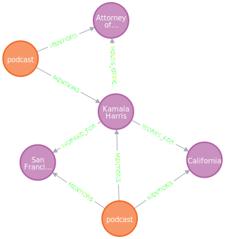

# graphiti: Temporal Knowledge Graphs for LLM-powered Agents

[](https://github.com/getzep/graphiti/actions/workflows/lint.yml)
[](https://github.com/getzep/graphiti/actions/workflows/unit_tests.yml)
[](https://github.com/getzep/graphiti/actions/workflows/typecheck.yml)
[](https://codespaces.new/getzep/graphiti)

graphiti builds dynamic, temporally-aware knowledge graphs that represent complex, evolving relationships between entities over time. graphiti ingests both unstructured and structured data and the resulting graph may be queried using a fusion of time, full-text, semantic, and graph algorithm approaches.

TODO: Add video here.

With graphiti, you can build LLM applications such as:

- Assistants that learn from user interactions, fusing personal knowledge with dynamic data from business systems like CRMs and billing platforms.
- Agents that autonomously execute complex tasks, reasoning with state changes from multiple dynamic sources.

graphiti supports a wide range of applications in sales, customer service, health, finance, and more, enabling long-term recall and state-based reasoning for both assistants and agents.

## Why graphiti?

graphiti is designed for dynamic data and agentic use:

- **Smart Graph Updates**: Automatically evaluates new entities against the current graph, revising both to reflect the latest context.
- **Rich Edge Semantics**: Generates human-readable, semantic, and full-text searchable representations for edges during graph construction, enabling search and enhancing interpretability.
- **Temporal Awareness**: Extracts and updates time-based edge metadata from input data, enabling reasoning over changing relationships.
- **Hybrid Search**: Offers semantic, BM25, and graph-based search with the ability to fuse results.
- **Fast**: Search results in < 100ms, with latency primarily determined by the 3rd-party embedding API call.
- **Schema Consistency**: Maintains a coherent graph structure by reusing existing schema, preventing unnecessary proliferation of node and edge types.

## graphiti and Zep Memory

graphiti powers the core of Zep's next-generation memory layer for LLM-powered Assistants and Agents.

We're excited to open-source graphiti, believing its potential reaches far beyond memory applications.

## Installation

Requirements:

- Python 3.10 or higher
- Neo4j 5.21 or higher
- OpenAI API key (for LLM inference and embedding)

Optional:

- Anthropic or Groq API key (for alternative LLM providers)

> [!NOTE]
> The simplest way to install Neo4j is via [Neo4j Desktop](https://neo4j.com/download/). It provides a user-friendly interface to manage Neo4j instances and databases.

`pip install graphiti-core`

or

`poetry add graphiti-core`

## Quick Start

> [!NOTE]
> Zep uses OpenAI for LLM inference and embedding. Ensure that an `OPENAI_API_KEY` is set in your environment.

Support for Anthropic and Groq LLM inferences is available, too.

```python
from graphiti_core import Graphiti
from graphiti_core.nodes import EpisodeType
from datetime import datetime

# Initialize Graphiti
graphiti = Graphiti("bolt://localhost:7687", "neo4j", "password")

# Add episodes
episodes = [
    "Kamala Harris is the Attorney General of California. She was previously "
    "the district attorney for San Francisco.",
    "As AG, Harris was in office from January 3, 2011 – January 3, 2017",
]
for i, episode in enumerate(episodes):
    await graphiti.add_episode(
        name=f"Freakonomics Radio {i}",
        episode_body=episode,
        source=EpisodeType.text,
        source_description="podcast",
        reference_time=datetime.now()
    )

# Search the graph
# Execute a hybrid search combining semantic similarity and BM25 retrieval
# Results are combined and reranked using Reciprocal Rank Fusion
results = await graphiti.search('Who was the California Attorney General?')

EntityEdge(
│   uuid='3133258f738e487383f07b04e15d4ac0',
│   source_node_uuid='2a85789b318d4e418050506879906e62',
│   target_node_uuid='baf7781f445945989d6e4f927f881556',
│   created_at=datetime.datetime(2024, 8, 26, 13, 13, 24, 861097),
│   name='HELD_POSITION',
    # the fact reflects the updated state that Harris is
    # no longer the AG of California
│   fact='Kamala Harris was the Attorney General of California',
│   fact_embedding=[
│   │   -0.009955154731869698,
│       ...
│   │   0.00784289836883545
│   ],
│   episodes=['b43e98ad0a904088a76c67985caecc22'],
│   expired_at=datetime.datetime(2024, 8, 26, 20, 18, 1, 53812),
    # These dates represent the date this edge was true.
│   valid_at=datetime.datetime(2011, 1, 3, 0, 0, tzinfo=<UTC>),
│   invalid_at=datetime.datetime(2017, 1, 3, 0, 0, tzinfo=<UTC>)
)


# Rerank search results based on graph distance
# Provide a node UUID to prioritize results closer to that node in the graph.
# Results are weighted by their proximity, with distant edges receiving lower scores.
await client.search('Who was the California Attorney General?', center_node_uuid)

# Close the connection
graphiti.close()
```

## Documentation

### Creating Episodes

Episodes represent a single data ingestion event. An `episode` is itself a node, and any nodes identified while ingesting the episode are related to the episode via `mentions` edges.

Episodes enable querying for information at a point in time and understanding the provenance of nodes and their edge relationships.

Supported episode types:

- `text`: Unstructured text data
- `message`: Conversational messages of the format `speaker: message...`
- `json`: Structured data, processed distinctly from the other types

The graph below was generated using the code in the [Quick Start](#quick-start). Each "podcast" is an individual episode.



## How graphiti works

### Adding Data as Episodes


### Graph Search


two quickest wins for search using the graph database is:

1. chunking. The graph structure means we have preformed chunks and the existing structure allows us to better chunk new episodes. (good chunking is pretty underrated in RAG imo)
2. Traditional RAG search, for things like facts, is good at finding the small chunked snippets of information, but its bad for providing summarized or more general context. The graph structure allows us to provide this context.

That is why in the complex search we are returning facts which are more specific to the wuery, and nodes which provide summaries about the entities involved. And in the future we can provide community summaries or context based on other forms of graph traversal

And the key there vs fact triplets is that it accomplishes 1 almost as well as a graph, but getting 2 out is not possible without basically creating a pseudo-graph

## Status and Roadmap

wip, but endavour to not break API.

graphiti is under active development. Areas we're actively working on:

- performance and scalability
- search improvements
- node CRUD

TODO: expand on the above. Include ROADMAP

Latency scales sublinearly with graph size, with a cap

## Contributing

## Support
